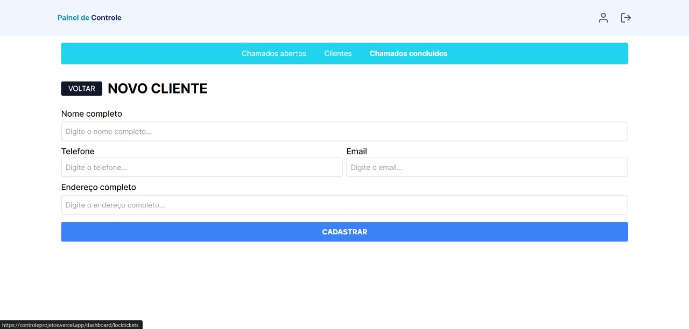
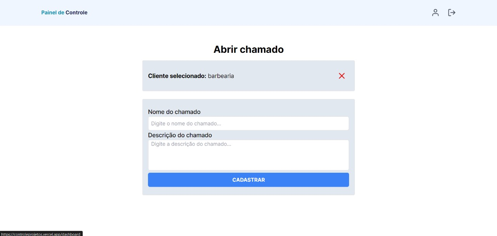

# Controle de Projetos

## Ferramentas Utilizadas

1. **Next.js:**
   - Next.js é um framework de desenvolvimento web React que permite construir aplicativos web modernos com facilidade. Ele oferece uma arquitetura baseada em componentes e facilita a criação de páginas estáticas, dinâmicas ou híbridas.
2. **Prisma:**
   - Prisma é uma ferramenta de banco de dados que simplifica e aprimora o acesso aos bancos de dados. Ele oferece um ORM (Object-Relational Mapping) moderno, permitindo que os desenvolvedores interajam com o banco de dados usando uma interface de programação em vez de SQL tradicional. Prisma facilita a manipulação de dados e reduz a complexidade das consultas.

3. **MongoDB:**
   - MongoDB é um banco de dados NoSQL orientado a documentos. Ele armazena dados em formato JSON e é altamente escalável, flexível e fácil de usar. MongoDB é amplamente utilizado em aplicativos que exigem manipulação de dados não estruturados ou semi-estruturados, proporcionando um modelo de dados dinâmico e escalabilidade horizontal.

4. **Tailwind CSS:**
   - Tailwind CSS é uma estrutura de estilo utilitária para a construção de interfaces. Em vez de fornecer componentes predefinidos, o Tailwind permite que você construa estilos diretamente em seus elementos HTML usando classes utilitárias. Isso oferece uma abordagem altamente customizável e eficiente para o design de interfaces.

5. **Zod:**
   - O Zod é uma biblioteca voltada para TypeScript, oferecendo funcionalidades de declaração e validação de esquema. O termo "esquema" aqui refere-se de forma ampla a qualquer tipo de dados, desde simples strings até objetos aninhados complexos.

6. **sweetalert2:**
   - SweetAlert2 é uma biblioteca JavaScript popular para criar notificações e modais personalizadas, como alertas, confirmações e prompts. 

## Funcionalidades do projeto:
  - **Home(Página inicial)**
   
  - **Chamados Abertos:**
   
  - **Criar chamado:**
   
  - **Clientes:**
   
  - **Criar um cliente:**
   
  - **Chamados fechados(concluídos):**
   
  - **Criar chamado não logado:**
   
  - **Efetuar chamado:**
   

## Getting Started

Para iniciar o servidor de desenvolvimento, siga as instruções abaixo:

```bash
npm run dev
# ou
yarn dev
# ou
pnpm dev
# ou
bun dev
